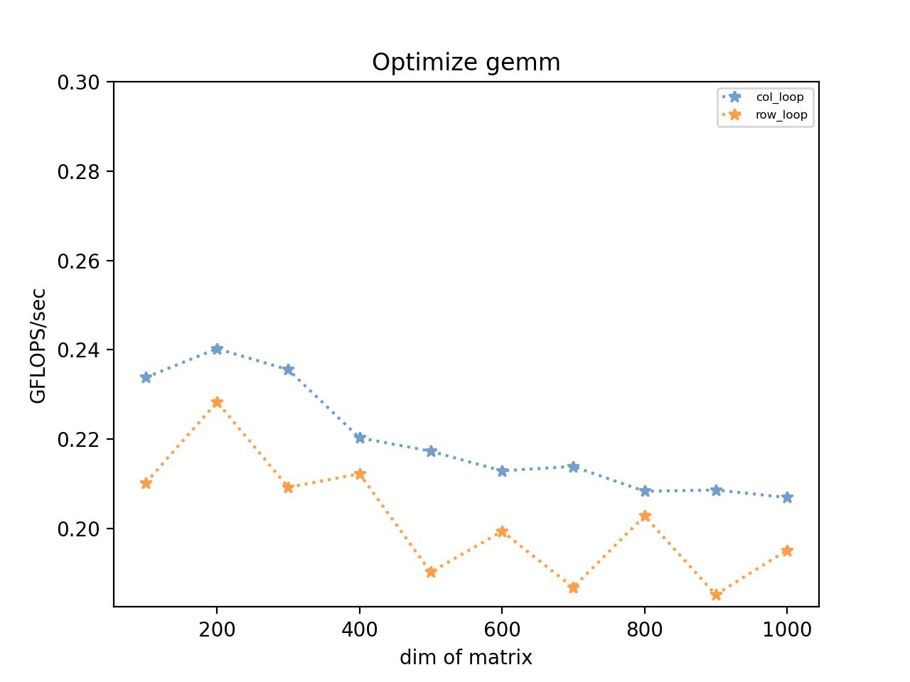
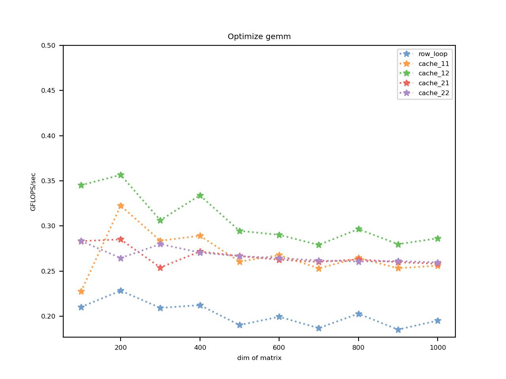
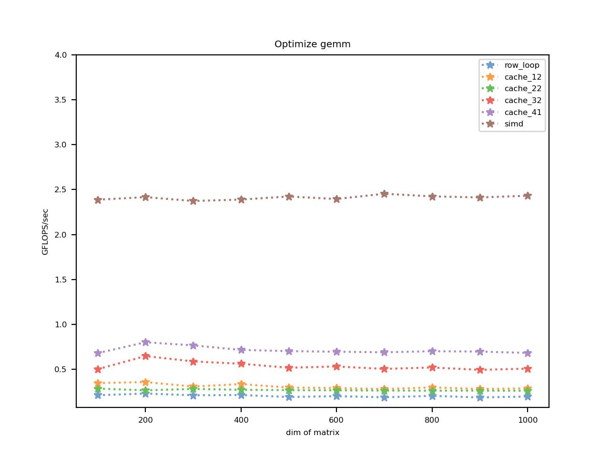

# MMO
Matrix Multiplication Optimization


## 0 预先准备


### 0.1 矩阵的定义

通过一个一维的数组模拟矩阵，内存存储方式按照列的顺序

同时，为了方便测试和编程，矩阵全定义为方矩阵，也就是三个矩阵的行列都等于dim

```cpp
mat(i,j) = mat[j*dim + i]
```


### 0.2 代码框架

对矩阵乘法函数的定义如下，通过A、B指针运算，结果保存在C中

```cpp
typedef void (*mul_fun)(const float *, const float *, float *, int);
```


通过check函数判断矩阵乘法函数是否正确，在写完一个乘法函数以后必须通过这个函数来确保乘法的正确性

```cpp
typedef void (*mul_fun)(const float *, const float *, float *, int);

void check(mul_fun fun1, mul_fun fun2, int dim) {
    const float EPS = 0.1;

    float *matA = create_random_matrix(dim);
    float *matB = create_random_matrix(dim);
    float *matC1 = create_zero_matrix(dim);
    float *matC2 = create_zero_matrix(dim);

    fun1(matA, matB, matC1, dim);
    fun2(matA, matB, matC2, dim);

    bool ok = true;
    for (int i = 0; i < dim * dim; ++i) {
        if (abs(matC1[i] - matC2[i]) > EPS) {
            cerr << matC1[i] << " " << matC2[i] << " is not equal! Function is error!" << endl;
            ok = false;
            break;
        }
    }
    if (ok) cout << "AC" << endl;

    delete[] matA, matB, matC1, matC2;
}
```


通过test函数测试矩阵乘法函数的效率，将执行结果保存在日志文件中

```cpp
void test(mul_fun fun, int test_times, const string &log_name) {
    LARGE_INTEGER st, et, freq;
    ofstream logger("../logs/" + log_name + ".log");
    if (!logger) {
        cerr << "Cant create " + log_name + ".log" << endl;
        exit(-1);
    } else {
        cout << "Start testing. Save in : " << log_name + ".log" << endl;
    }
    for (int dim = MIN_DIM; dim <= MAX_DIM; dim += STEP) {
        double total_time = 0;
        cout << "Testing dim :" << dim << endl;
        QueryPerformanceFrequency(&freq);
        for (int i = 0; i < test_times; ++i) {
            float *matA = create_random_matrix(dim);
            float *matB = create_random_matrix(dim);
            float *matC = create_zero_matrix(dim);

            QueryPerformanceCounter(&st);
            fun(matA, matB, matC, dim);
            QueryPerformanceCounter(&et);

            total_time += (double) (et.QuadPart - st.QuadPart) / (double) freq.QuadPart;
            delete[] matA, matB, matC;
        }
        logger << dim << ' ' << test_times << ' ' << total_time << '\n';
    }
    logger.close();
}

```


通过visual.py脚本可视化日志文件，从而得到运行效率结果。

```python
#导入库
import matplotlib.pyplot as plt
import numpy as np
import palettable
from palettable.tableau import TableauMedium_10
from argparse import ArgumentParser

all_file_list = ['col_loop','row_loop']
use_file_list = [0,1]
base_path = "./logs/"
markers = ['o','*','*','*','*','*','*','1','^','1']

def main():
    parser = ArgumentParser()
    parser.add_argument('--n', type=str, default="result")
    parser.add_argument('--t', type=float, default=0.5)
    conf = parser.parse_args()

    fig=plt.figure(dpi=200)

    for i in range(len(use_file_list)):
        name = all_file_list[use_file_list[i]]
        with open(base_path+name+".log","r") as fp:
            x = []
            y = []
            lines=fp.readlines()
            for line in lines:
                dim, num, time = line.split(' ')
                dim = int(dim)
                num = int(num)
                time = float(time)
                gf = (dim*dim*dim*num) /(10**9*time)
                y.append(gf)
                x.append(dim)
            plt.plot(x, y, label=name, ls=':', color=TableauMedium_10.mpl_colors[i], marker='*')
    plt.title("Optimize gemm")
    plt.rcParams.update({'font.size':6})
    plt.legend(loc="best") 
    plt.xlabel("dim of matrix", loc="center")
    plt.ylabel("GFLOPS/sec", loc="center")
    plt.ylim(top=conf.t)
    plt.show()
    fig.savefig(f"./images/{conf.n}.jpg")


if __name__ == "__main__":
    main()

```


### 0.3 性能评判标准

为了消除矩阵维数对时间的影响，性能评判标准通过计算 GFLOPS / sec 来比较

GFLOPS / sec 越高意味着计算速度越快，效率越高

其中： GFLOPS / sec = （dim^3) / (10^9 * time * test_times)


## 1 乘法优化


### 1.1 循环

由于内存的排列顺序影响，不同的循环顺序可能会影响效率，接下来测试两种循环

```cpp
void row_loop(const float *A, const float *B, float *C, int dim) {
    int i, j, p;
    for (j = 0; j < dim; ++j) {
        for (i = 0; i < dim; ++i) {
            for (p = 0; p < dim; ++p) {
                C[index(i, j)] += A[index(i, p)] * B[index(p, j)];
            }
        }
    }
}

void col_loop(const float *A, const float *B, float *C, int dim) {
    int i, j, p;
    for (i = 0; i < dim; ++i) {
        for (j = 0; j < dim; ++j) {
            for (p = 0; p < dim; ++p) {
                C[index(i, j)] += A[index(i, p)] * B[index(p, j)];
            }
        }
    }
}
```

测试结果如下：



**可以看到，col_loop的效果略优于row_loop，但是由于我们接下来的优化都是对于矩阵B的优化，所以接下来的测试还是保持row_loop**


### 1.2 cache优化

#### 1.2.1 优化尝试1：减少矩阵C的调用

```cpp
void cache_11(const float *A, const float *B, float *C, int dim) {
    int i, j, p, u;
    float reg;
    for (j = 0; j < dim; ++j) {
        for (i = 0; i < dim; ++i) {
            reg = 0;
            for (p = 0; p < dim; ++p) {
                reg += A[index(i, p)] * B[index(p, j)];
            }
            C[index(i, j)] = reg;
        }
    }
}

// 使用寄存器
void cache_12(const float *A, const float *B, float *C, int dim) {
    int i, j, p, u;
    register float reg;
    for (j = 0; j < dim;  ++j) {
        for (i = 0; i < dim; ++i) {
            reg = 0;
            for (p = 0; p < dim; ++p) {
                reg += A[index(i, p)] * B[index(p, j)];
            }
            C[index(i, j)] = reg;
        }
    }
}
```

测试结果如下：


**可以看到，减少矩阵C的调用，速度有了明显的提升，而且使用一个寄存器也有略微的提升。**


#### 1.2.2 优化尝试2：一次求矩阵C的4个值

```cpp
void cache_21(const float *A, const float *B, float *C, int dim) {
    int i, j, p, u;
    float reg[4];
    for (j = 0; j < dim; j += 4) {
        for (i = 0; i < dim; ++i) {
            for (u = 0; u < 4; ++u) reg[u] = 0;
            for (p = 0; p < dim; ++p) {
                for (u = 0; u < 4; ++u)
                    reg[u] += A[index(i, p)] * B[index(p, j + u)];
            }
            for (u = 0; u < 4; ++u) C[index(i, j + u)] = reg[u];
        }
    }
}

// 使用寄存器
void cache_22(const float *A, const float *B, float *C, int dim) {
    int i, j, p, u;
    register float reg[4];
    for (j = 0; j < dim; j += 4) {
        for (i = 0; i < dim; ++i) {
            for (u = 0; u < 4; ++u) reg[u] = 0;
            for (p = 0; p < dim; ++p) {
                for (u = 0; u < 4; ++u)
                    reg[u] += A[index(i, p)] * B[index(p, j + u)];
            }
            for (u = 0; u < 4; ++u) C[index(i, j + u)] = reg[u];
        }
    }
}

```

测试结果如下：




#### 1.2.3 优化尝试3：通过指针移动来获取矩阵B的值

```cpp
void cache_31(const float *A, const float *B, float *C, int dim) {
    int i, j, p, u;
    float c_reg;
    float *b_ptr, *bb_ptr;
    b_ptr = const_cast<float *>(&B[0]);

    for (j = 0; j < dim; ++j,b_ptr += dim) {
        for (i = 0; i < dim; ++i) {
            bb_ptr = b_ptr;
            c_reg = 0;
            for (p = 0; p < dim; ++p) {
                c_reg += A[index(i,p)] * *bb_ptr++;
            }
            C[index(i, j)] = c_reg;
        }
    }
}

void cache_32(const float *A, const float *B, float *C, int dim) {
    int i, j, p, u;
    float c_reg0, c_reg1, c_reg2, c_reg3, a_reg;
    float *b0_ptr, *b1_ptr, *b2_ptr, *b3_ptr, *bb0_ptr, *bb1_ptr, *bb2_ptr, *bb3_ptr;
    auto *b_ptr = const_cast<float *>(&B[0]);

    for (j = 0; j < dim; j += 4) {

        b0_ptr = b_ptr;
        b_ptr += dim;
        b1_ptr = b_ptr;
        b_ptr += dim;
        b2_ptr = b_ptr;
        b_ptr += dim;
        b3_ptr = b_ptr;
        b_ptr += dim;

        for (i = 0; i < dim; ++i) {

            bb0_ptr = b0_ptr;
            bb1_ptr = b1_ptr;
            bb2_ptr = b2_ptr;
            bb3_ptr = b3_ptr;

            c_reg0 = c_reg1 = c_reg2 = c_reg3 = 0;

            for (p = 0; p < dim; ++p) {
                a_reg = A[index(i, p)];

                c_reg0 += a_reg * *bb0_ptr++;
                c_reg1 += a_reg * *bb1_ptr++;
                c_reg2 += a_reg * *bb2_ptr++;
                c_reg3 += a_reg * *bb3_ptr++;
            }
            C[index(i, j)] = c_reg0;
            C[index(i, j + 1)] = c_reg1;
            C[index(i, j + 2)] = c_reg2;
            C[index(i, j + 3)] = c_reg3;
        }
    }
}

void cache_33(const float *A, const float *B, float *C, int dim) {
    int i, j, p, u;
    float c_regs[4];
    float a_reg;
    float *b_ptr_arr[4];
    float *bb_ptr_arr[4];
    auto *b_ptr = const_cast<float *>(&B[0]);

    for (j = 0; j < dim; j += 4) {

        for (u = 0; u < 4; ++u, b_ptr += dim) {
            b_ptr_arr[u] = b_ptr;
        }

        for (i = 0; i < dim; ++i) {
            for (u = 0; u < 4; ++u) {
                bb_ptr_arr[u] = b_ptr_arr[u];
                c_regs[u] = 0;
            }
            for (p = 0; p < dim; ++p) {
                a_reg = A[index(i, p)];
                for (u = 0; u < 4; ++u) {
                    c_regs[u] += a_reg * *bb_ptr_arr[u]++;
                }

            }
            for (u = 0; u < 4; ++u) {
                C[index(i, j + u)] += c_regs[u];
            }
        }
    }
}

```

测试结果如下：


**可以看到，Cache32的表现非常亮眼，一骑绝尘，但是也要注意到，不能为了代码简练而写成33，否则效率大打折扣**


#### 1.2.4 优化尝试4：矩阵块乘

```cpp
void cache_41(const float *A, const float *B, float *C, int dim) {
    int i, j, p, u;
    float reg00, reg01, reg02, reg03;
    float reg10, reg11, reg12, reg13;
    float reg20, reg21, reg22, reg23;
    float reg30, reg31, reg32, reg33;

    float a0_reg, a1_reg, a2_reg, a3_reg;

    float *b0_ptr, *b1_ptr, *b2_ptr, *b3_ptr, *bb0_ptr, *bb1_ptr, *bb2_ptr, *bb3_ptr;
    auto *b_ptr = const_cast<float *>(&B[0]);
    auto *a_ptr = const_cast<float *>(&A[0]);
    float *aa_ptr, *c_ptr, *cc_ptr;
    for (j = 0; j < dim; j += 4) {

        b0_ptr = b_ptr;
        b_ptr += dim;
        b1_ptr = b_ptr;
        b_ptr += dim;
        b2_ptr = b_ptr;
        b_ptr += dim;
        b3_ptr = b_ptr;
        b_ptr += dim;

        for (i = 0; i < dim; i += 4) {

            bb0_ptr = b0_ptr;
            bb1_ptr = b1_ptr;
            bb2_ptr = b2_ptr;
            bb3_ptr = b3_ptr;

            reg00 = reg01 = reg02 = reg03 = 0;
            reg10 = reg11 = reg12 = reg13 = 0;
            reg20 = reg21 = reg22 = reg23 = 0;
            reg30 = reg31 = reg32 = reg33 = 0;

            for (p = 0; p < dim; ++p, aa_ptr += dim) {
                aa_ptr = a_ptr + p * dim + i;
                a0_reg = *aa_ptr++;
                a1_reg = *aa_ptr++;
                a2_reg = *aa_ptr++;
                a3_reg = *aa_ptr++;

                reg00 += a0_reg * *bb0_ptr;
                reg10 += a1_reg * *bb0_ptr;
                reg20 += a2_reg * *bb0_ptr;
                reg30 += a3_reg * *bb0_ptr;
                ++bb0_ptr;

                reg01 += a0_reg * *bb1_ptr;
                reg11 += a1_reg * *bb1_ptr;
                reg21 += a2_reg * *bb1_ptr;
                reg31 += a3_reg * *bb1_ptr;
                ++bb1_ptr;

                reg02 += a0_reg * *bb2_ptr;
                reg12 += a1_reg * *bb2_ptr;
                reg22 += a2_reg * *bb2_ptr;
                reg32 += a3_reg * *bb2_ptr;
                ++bb2_ptr;

                reg03 += a0_reg * *bb3_ptr;
                reg13 += a1_reg * *bb3_ptr;
                reg23 += a2_reg * *bb3_ptr;
                reg33 += a3_reg * *bb3_ptr;
                ++bb3_ptr;
            }
            c_ptr = &C[index(i, j)];
            cc_ptr = c_ptr;
            *cc_ptr++ = reg00;
            *cc_ptr++ = reg10;
            *cc_ptr++ = reg20;
            *cc_ptr = reg30;

            c_ptr += dim;
            cc_ptr = c_ptr;
            *cc_ptr++ = reg01;
            *cc_ptr++ = reg11;
            *cc_ptr++ = reg21;
            *cc_ptr = reg31;

            c_ptr += dim;
            cc_ptr = c_ptr;
            *cc_ptr++ = reg02;
            *cc_ptr++ = reg12;
            *cc_ptr++ = reg22;
            *cc_ptr = reg32;

            c_ptr += dim;
            cc_ptr = c_ptr;
            *cc_ptr++ = reg03;
            *cc_ptr++ = reg13;
            *cc_ptr++ = reg23;
            *cc_ptr = reg33;

        }
    }
}
```

测试结果如下：


**可以看到，虽然Cache32的表现非常亮眼，但是Cache41还是更胜一筹，块乘可以很大程度上减少内存调用，提升Cache的命中率**


### 1.3 向量指令乘法（SIMD）

```cpp
void simd(const float *A, const float *B, float *C, int dim) {
    int i, j, p, u;

    float *c0_ptr, *c1_ptr, *c2_ptr, *c3_ptr;
    float *b0_ptr, *b1_ptr, *b2_ptr, *b3_ptr;
    auto *packedA = new float[4 * dim];
    float *p_ptr, *a_ptr, *b_ptr;
    float *aa_ptr, *bb_ptr, *cc_ptr;
    float *t_ptr;

    __m128 cv0, cv1, cv2, cv3;
    __m128 va0, va1, va2, va3;
    __m128 vb0, vb1, vb2, vb3;
    __m128 vc0, vc1, vc2, vc3;
    // data : A[mxk]  B[kxn]
    aa_ptr = const_cast<float *>(A);
    bb_ptr = const_cast<float *>(B);
    cc_ptr = C;

    for (i = 0; i < dim; i += 4) {
        p_ptr = packedA;
        for (p = 0; p < dim; ++p) {
            a_ptr = aa_ptr + p * dim + i;
            for (u = 0; u < 4; ++u) {
                *p_ptr++ = *a_ptr++;
            }
        }

        b_ptr = bb_ptr;
        for (j = 0; j < dim; j += 4) {
            p_ptr = packedA;
            t_ptr = bb_ptr + j * dim;
            b0_ptr = t_ptr;
            t_ptr += dim;
            b1_ptr = t_ptr;
            t_ptr += dim;
            b2_ptr = t_ptr;
            t_ptr += dim;
            b3_ptr = t_ptr;

            cv0 = _mm_setzero_ps();
            cv1 = _mm_setzero_ps();
            cv2 = _mm_setzero_ps();
            cv3 = _mm_setzero_ps();

            for (p = 0; p < dim; p += 4) {
                // mul : A[i:i+4,p:p+4] B[p:p+4,j:j+4]
                va0 = _mm_load_ps(p_ptr);
                p_ptr += 4;
                va1 = _mm_load_ps(p_ptr);
                p_ptr += 4;
                va2 = _mm_load_ps(p_ptr);
                p_ptr += 4;
                va3 = _mm_load_ps(p_ptr);
                p_ptr += 4;

                cv0 += va0 * *b0_ptr++;
                cv0 += va1 * *b0_ptr++;
                cv0 += va2 * *b0_ptr++;
                cv0 += va3 * *b0_ptr++;

                cv1 += va0 * *b1_ptr++;
                cv1 += va1 * *b1_ptr++;
                cv1 += va2 * *b1_ptr++;
                cv1 += va3 * *b1_ptr++;

                cv2 += va0 * *b2_ptr++;
                cv2 += va1 * *b2_ptr++;
                cv2 += va2 * *b2_ptr++;
                cv2 += va3 * *b2_ptr++;

                cv3 += va0 * *b3_ptr++;
                cv3 += va1 * *b3_ptr++;
                cv3 += va2 * *b3_ptr++;
                cv3 += va3 * *b3_ptr++;
            }

            cc_ptr = &C[index(i, j)];
            _mm_store_ps(cc_ptr, cv0);
            cc_ptr += dim;
            _mm_store_ps(cc_ptr, cv1);
            cc_ptr += dim;
            _mm_store_ps(cc_ptr, cv2);
            cc_ptr += dim;
            _mm_store_ps(cc_ptr, cv3);
            cc_ptr += dim;
        }
    }
    delete[] packedA;
}
```

真正的大哥出现了：



### 1.4 线程级并行

本以为SIMD已经天下无敌了，没想到有人比他还勇猛，堂下何人！！！

没错，正是多线程优化

```cpp
void mul_thread(float *a_ptr, float *b_ptr, float *c_ptr, int dim) {
    int i, j, p, u;
    float *aa_ptr, *bb_ptr, *cc_ptr, *p_ptr;
    __m128 va0, va1, va2, va3;
    __m128 vb, vc;
    auto *packedA = new float[4 * dim];
    int num_col = dim / 4;

    for (i = 0; i < dim; i += 4) {
        p_ptr = packedA;
        for (p = 0; p < dim; ++p) {
            aa_ptr = a_ptr + p * dim + i;
            for (u = 0; u < 4; ++u) {
                *p_ptr++ = *aa_ptr++;
            }
        }
        bb_ptr = b_ptr;
        cc_ptr = c_ptr;
        for (j = 0; j < num_col; ++j) {
            vc = _mm_setzero_ps();
            aa_ptr = packedA;
            for (p = 0; p < dim; p += 4) {
                va0 = _mm_load_ps(aa_ptr);
                aa_ptr += 4;
                va1 = _mm_load_ps(aa_ptr);
                aa_ptr += 4;
                va2 = _mm_load_ps(aa_ptr);
                aa_ptr += 4;
                va3 = _mm_load_ps(aa_ptr);
                aa_ptr += 4;

                vc += va0 * *bb_ptr++;
                vc += va1 * *bb_ptr++;
                vc += va2 * *bb_ptr++;
                vc += va3 * *bb_ptr++;
            }
            _mm_store_ps(cc_ptr, vc);
            cc_ptr += dim;
        }
        c_ptr += 4;
    }
    delete[] packedA;
}

void thread1(const float *A, const float *B, float *C, int dim) {
    int i, j, p, u, num_col;
    pthread_t tid_list[4];
    auto *a_ptr = const_cast<float *>(A);
    auto *b_ptr = const_cast<float *>(B);
    auto *c_ptr = C;
    thread th1(mul_thread, a_ptr, b_ptr, c_ptr, dim);
    num_col = dim / 4;
    c_ptr += num_col * dim;
    b_ptr += num_col * dim;
    thread th2(mul_thread, a_ptr, b_ptr, c_ptr, dim);
    c_ptr += num_col * dim;
    b_ptr += num_col * dim;
    thread th3(mul_thread, a_ptr, b_ptr, c_ptr, dim);
    c_ptr += num_col * dim;
    b_ptr += num_col * dim;
    thread th4(mul_thread, a_ptr, b_ptr, c_ptr, dim);

    th1.join();
    th2.join();
    th3.join();
    th4.join();
}
```


